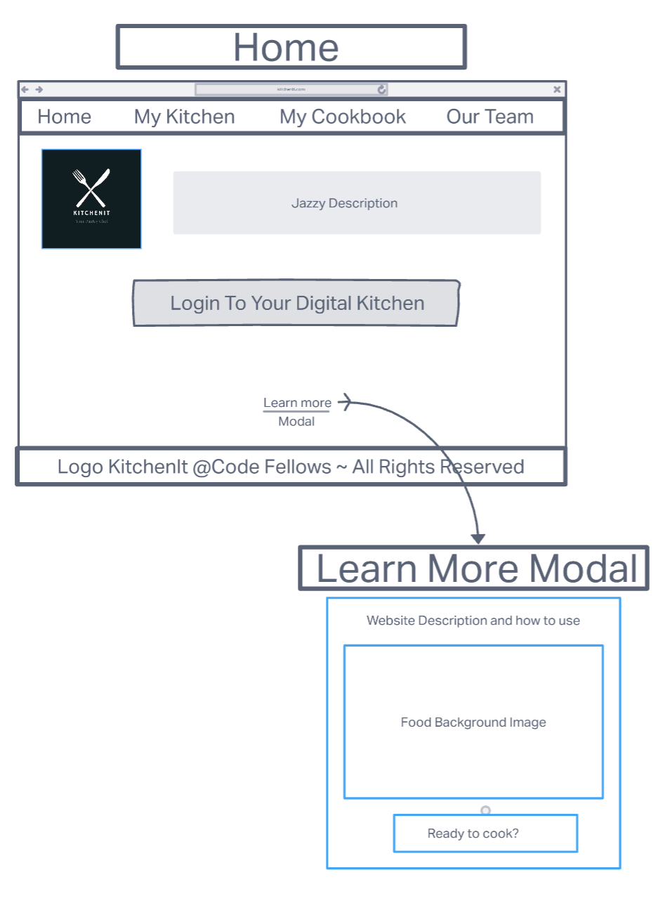
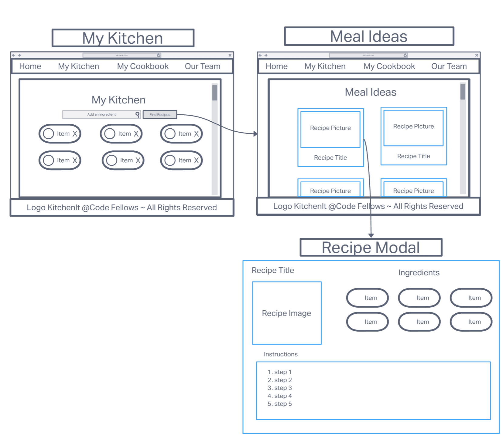
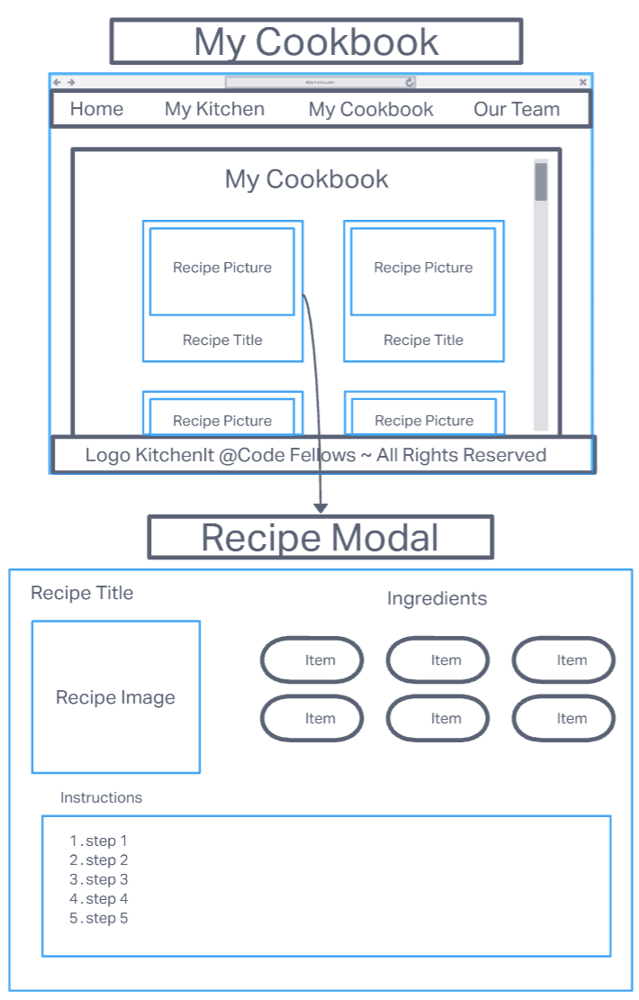
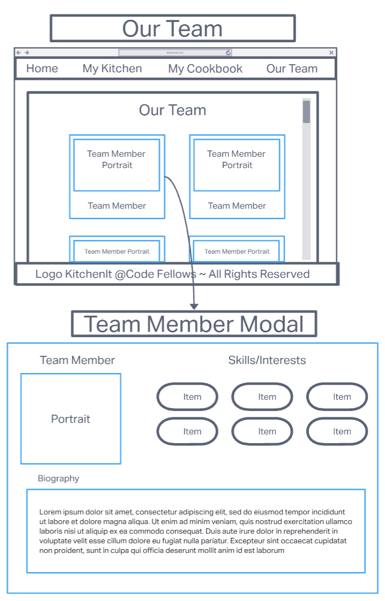
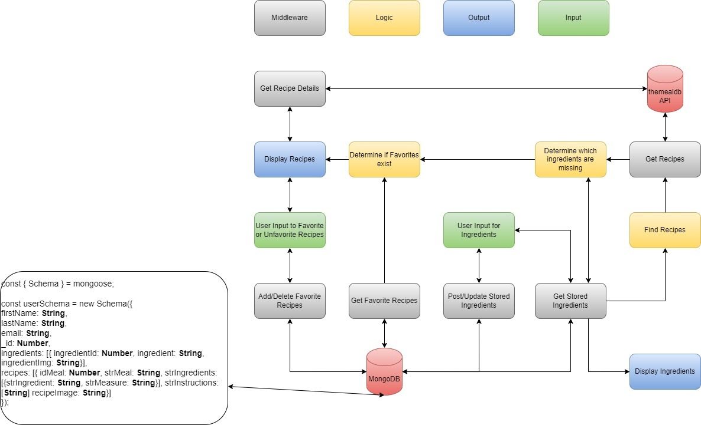

# KitchenIt

Introducing KitchenIt - your ultimate solution for pantry organization and meal planning! With our innovative digital platform, you can easily add ingredients that you have in your home and instantly access a treasure trove of mouth-watering meal ideas.

No more staring aimlessly at your pantry, wondering what to cook with the ingredients on hand. KitchenIt makes it a breeze to whip up delicious meals that satisfy your cravings and culinary ambitions. And if you need to stock up on a few additional items, our platform will guide you every step of the way.

So what are you waiting for? Sign up for KitchenIt today and elevate your home cooking game like never before!

## Wireframes of KitchenIt

### Home

### My Kitchen / Meal Ideas

### My Cookbook

### Our Team Page

## Project Management

[Location of Project Management Board](https://github.com/orgs/const-mangoDB/projects/1)

## Domain Model / Database Schema

## Team Members

- Paula Davidson
- Nick Mullaney
- Jeremy Adamson
- Matt Austin
